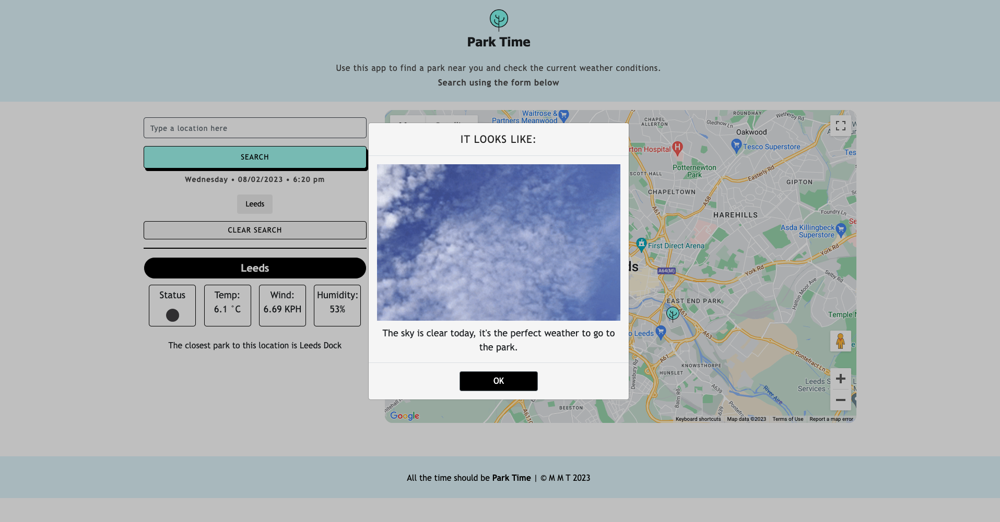

# Park Time

## Description
This application is an interactive dashboard for people who love to go to the park. The app prompts the user to enter a location they are interested in, upon search the app uses the openweather API to retrieve current weather data (weather condition icon, temperature, wind speed and humidity) along with the Google Maps API to show the selected area and to mark parks within a 500m radius of the chosen location. The user is also prompted with park tips and a gif depending on the weather conditions.

## User Story

## Technology
This app runs in the browser and features dynamically updated HTML and CSS powered by jQuery, moment.js, Giphy API, GoogleMaps API and OpenWeatherMap API.

## Installation
The webpage can be accessed using any web browser on any device (desktop, laptop, tablet, mobile) however, using Google Chrome on a desktop or laptop is recommended.

## Deployed Link
This webpage can be accessed at https://nattytatat.github.io/project-one-m-m-t/ the homescreen looks as follows; .

## Licences
This app is licensed under the MIT license.

## Credits
Thanks to Dan Mueller for being an excellent instructor and thanks to Sandy Smith for her guidance.